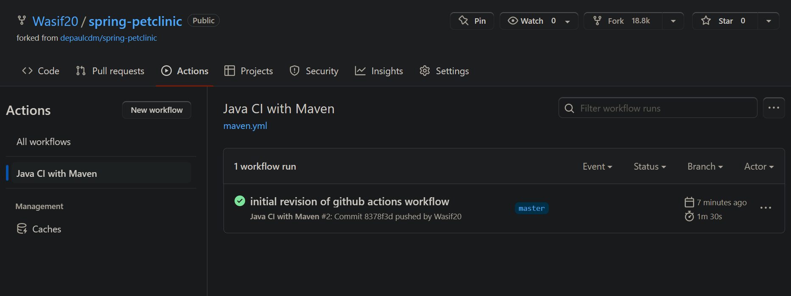
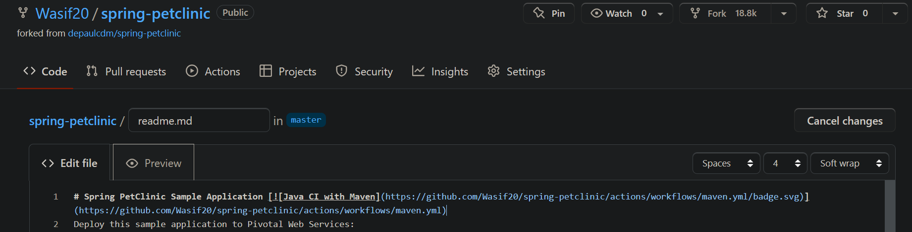
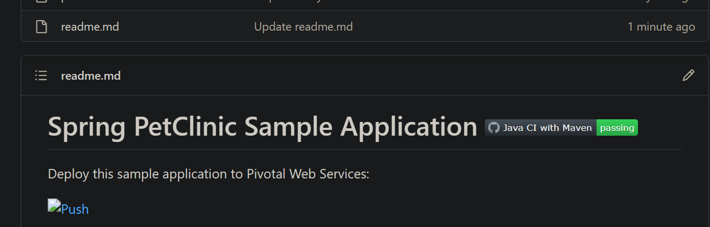
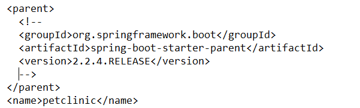
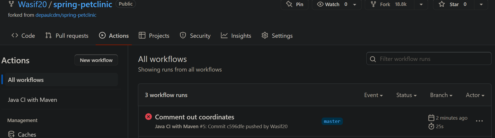
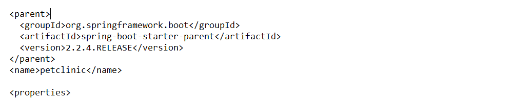

Wasif Siddiqui ID 2072771.

1. Your GitHub Actions dashboard showing a successful first build.

2.Your GitHub repository with the readme.md file selected showing the code that you changed to update the badge.

3.Your GitHub repository with the readme.md file selected showing the build success status after you’ve updated the badge markdown.

4. The section of the POM file showing the coordinates after you’ve commented them out.

5. Your GitHub Actions dashboard showing the unsuccessful build after the breaking change.

6.The section of the POM file showing the coordinates after you’ve fixed them.

7.

